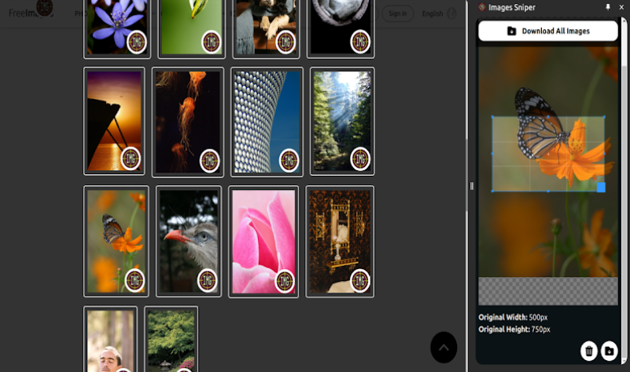

# Images Sniper Chrome Extension
### Check at [Chrome Web Store - Images Sniper](https://chromewebstore.google.com/detail/images-sniper/npnednigbhjjgbaflkcjjmfbfnmifjep)

This Chrome extension allows users to edit images on web pages directly within a side panel. Users can select any image on a webpage, crop it using an interactive canvas, and download individual edited images or all edited images as a zip file.

## Screenshots


## Features

- Target and select images on any web page
- Edit images in a side panel using an interactive canvas
- Crop functionality powered by CropperJS
- Download individual edited images
- Download all edited images as a zip file

## Technologies Used

- [Vite](https://vitejs.dev/): Next Generation Frontend Tooling
- [Vue.js](https://vuejs.org/): The Progressive JavaScript Framework
- [CropperJS](https://fengyuanchen.github.io/cropperjs/): JavaScript image cropper

## Installation

1. Clone this repository:
   ```
   git clone https://github.com/yourusername/images-sniper-chrome-extension.git
   ```

2. Navigate to the project directory:
   ```
   cd images-sniper-chrome-extension
   ```

3. Install dependencies:
   ```
   npm install
   ```

4. Build the extension:
   ```
   npm run build
   ```

5. Load the extension in Chrome:
   - Open Chrome and navigate to `chrome://extensions`
   - Enable "Developer mode" in the top right corner
   - Click "Load unpacked" and select the `dist` folder in your project directory

## Usage

1. Navigate to any webpage with images
2. Click on the extension icon in your Chrome toolbar
3. Select an image on the page to edit
4. Use the cropping tools in the side panel to edit the image
5. Download the edited image or continue editing other images
6. When finished, you can download all edited images as a zip file

## Contributing

I would like to hear your feedback at [Chrome Web Store - Images Sniper](https://chromewebstore.google.com/detail/images-sniper/npnednigbhjjgbaflkcjjmfbfnmifjep).

## License

This project is licensed under the [MIT License](LICENSE).